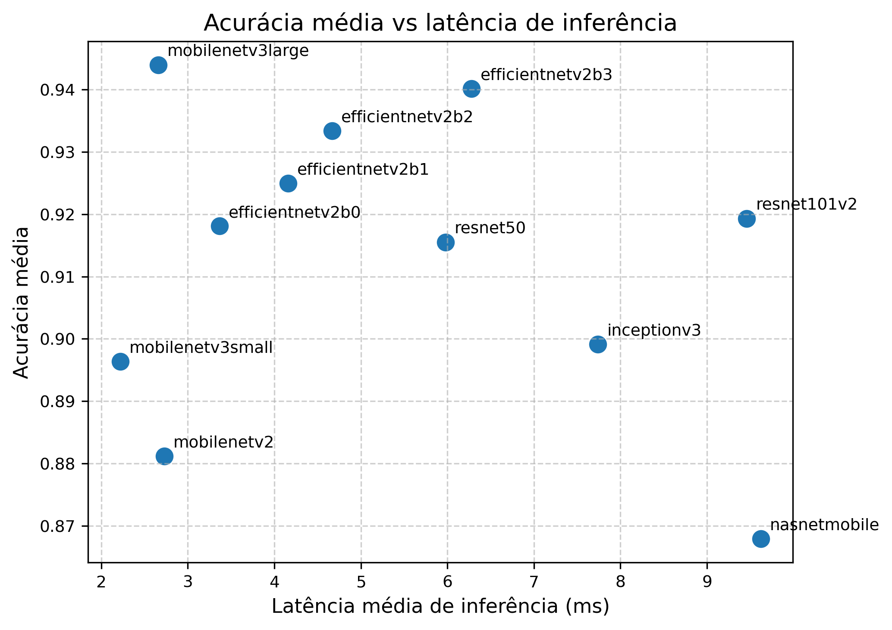

# DeepWeeds-Mobile: Análise Comparativa de Modelos CNN Mobile

Este repositório contém os códigos, experimentos e resultados do trabalho de **pesquisa de mestrado** focado no treinamento, avaliação e comparação de arquiteturas *mobile* e *não-mobile* aplicadas ao **dataset DeepWeeds**.

O objetivo central do projeto é investigar o compromisso entre **desempenho preditivo** (accuracy, precision, recall, F1-score) e **custo computacional** (parâmetros, FLOPs, MACs e latência de inferência), com ênfase em modelos adequados para **dispositivos embarcados e aplicações móveis no agronegócio**.

Todo o trabalho é **diretamente fundamentado no projeto DeepWeeds**, incluindo sua definição de classes, protocolo experimental e resultados de referência reportados no artigo original.

---

## Referência ao Dataset DeepWeeds

O **DeepWeeds** é um dataset público de imagens de plantas daninhas australianas, amplamente utilizado como benchmark em visão computacional aplicada à agricultura.

**Artigo de referência**:
> Olsen, A. et al. *DeepWeeds: A Multiclass Weed Species Image Dataset for Deep Learning.* Scientific Reports, 2019.

- 9 classes de plantas daninhas
- Imagens RGB capturadas em ambiente real
- Forte variabilidade de iluminação, escala e fundo

Este repositório **não redistribui as imagens**, apenas os códigos e resultados experimentais. Para executar os experimentos, o usuário deve obter o dataset diretamente da fonte oficial.

---

## Objetivos do Projeto

- Treinar e avaliar **arquiteturas CNN mobile e não-mobile** no dataset DeepWeeds
- Comparar os resultados obtidos com os reportados no artigo original
- Avaliar custo computacional dos modelos (parâmetros, FLOPs, MACs)
- Medir latência e throughput de inferência em cenário real
- Fornecer uma base reprodutível para pesquisa em **Deep Learning Mobile aplicado à Agricultura**

---

## Modelos Avaliados

Os seguintes modelos foram treinados utilizando *transfer learning* e *fine-tuning*:

### Modelos Mobile
- MobileNetV2
- MobileNetV3Small
- MobileNetV3Large
- EfficientNetV2B0
- EfficientNetV2B1
- EfficientNetV2B2
- EfficientNetV2B3
- NASNetMobile

### Modelos Não-Mobile (Referência)
- ResNet50
- ResNet101V2
- InceptionV3

Esses modelos permitem uma comparação direta entre arquiteturas otimizadas para dispositivos móveis e arquiteturas clássicas de alto custo computacional.

---

## 📁 Estrutura do Repositório

```text
analysis/                # Scripts de análise, consolidação e plotagem dos resultados
labels/                  # labels.csv com os rótulos do DeepWeeds
results/                 # Resultados de treinamento e relatórios por modelo
.gitignore
README.md
benchmark.py              # Benchmark de inferência com imagens reais do DeepWeeds
models_summary.json       # Parâmetros, FLOPs, MACs e métricas consolidadas por modelo
paths.py                  # Organização centralizada dos paths do projeto
pipeline.py               # Pipeline principal de treinamento CNN
pipelineViT.py            # Pipeline experimental para modelos ViT (em desenvolvimento)
plot_training_results.py  # Geração de gráficos de treino, validação e métricas
results.py                # Consolidação de métricas e inspeção dos modelos
run_benchmark.sh          # Script Bash para execução automatizada do benchmark
```

---

## 🔄 Fluxo Experimental

1. **Preparação dos dados**
   - Leitura do `labels.csv`
   - Split estratificado treino/validação

2. **Treinamento (pipeline.py)**
   - Backbone pré-treinado (ImageNet)
   - Treinamento da *classification head*
   - Fine-tuning parcial do backbone

3. **Avaliação**
   - Métricas por classe (precision, recall, F1, support)
   - Métricas globais (accuracy, macro e weighted)

4. **Análise Computacional (results.py)**
   - Número de parâmetros
   - Memória dos pesos
   - FLOPs e GMACs

5. **Benchmark de Inferência (benchmark.py)**
   - Inferência em imagens reais do DeepWeeds
   - Latência (p50, p95, média)
   - FPS

---

## 📊 Resultados e Análise Comparativa

### Os modelos treinados encontram-se disponíveis em: [Repositorio de Modelos DeepWeeds-Mobile](https://drive.google.com/drive/folders/11uHxJA8CDuSAT4BEAGDB7QMbUFpfMilt)

---

### 📐 Tabela Resumo: Parâmetros e Desempenho dos Modelos

A Tabela a seguir consolida os principais indicadores de cada arquitetura avaliada após *fine-tuning*, considerando:
- **Parâmetros totais** (milhões)
- **Custo computacional** (GMAC)
- **Latência de inferência** (ms, p50, batch = 1, imagens dummy)
- **Desempenho global** (F1-score ponderado)

| Modelo | Parâmetros (M) | GMAC | Latência p50 (ms) | F1-weighted |
|------|----------------|------|-------------------|-------------|
| MobileNetV3Small | 1.09 | 0.06 | 2.00 | 0.8966|
| MobileNetV2 | 2.59 | 0.31 | 2.57 | 0.8563 |
| MobileNetV3Large | 3.24 | 0.22 | 2.67 | 0.9227|
| EfficientNetV2B0 | 6.25 | 0.73 | 3.43 | 0.9127|
| EfficientNetV2B1 | 7.26 | 1.21 | 4.07 | 0.9262|
| EfficientNetV2B2 | 9.13 | 1.72 | 4.60 | 0.9364|
| EfficientNetV2B3 | 13.33 | 3.05 | 6.27 | 0.9392|
| NASNetMobile | 4.54 | 0.57 | 9.26 | 0.8760|
| ResNet50 | 24.11 | 3.88 | 6.12 | 0.9099	|
| ResNet101V2 | 43.15 | 7.22 | 9.30 | 0.9142|
| InceptionV3 | 22.33 | 5.73 | 7.22 | 0.9107|

> **Observação**: Os valores completos e reprodutíveis (incluindo precisão, recall e métricas por classe) encontram-se em `results/`, `results_macro.csv` e `models_summary.json`.

---
## Resultado de Acurácia por Latência de inferência



---

## 📝 Considerações Finais

Os resultados obtidos indicam que modelos convolucionais otimizados para dispositivos móveis são plenamente capazes de resolver o problema de classificação de plantas daninhas do dataset DeepWeeds, mantendo alto desempenho preditivo e reduzindo drasticamente o custo computacional.

Este trabalho contribui ao:
- Ampliar o benchmark DeepWeeds sob a ótica de **eficiência computacional**;
- Demonstrar a viabilidade de aplicações reais em **agricultura de precisão móvel**;
- Fornecer uma base experimental sólida e reprodutível para pesquisas futuras.

*Este repositório constitui parte integrante de um trabalho de mestrado e será continuamente refinado conforme a consolidação final da dissertação.*

